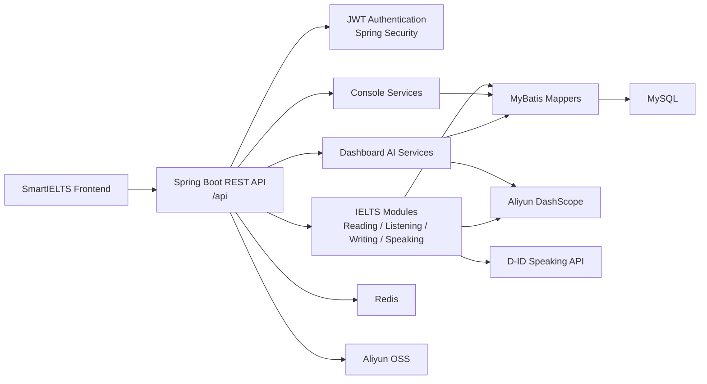

# <span style="font-size: 2.2em;">SmartIELTS Backend</span>

**SmartIELTS Backend** 是 SmartIELTS 系統的後端服務，負責 **身份驗證、權限控制、IELTS 四科考試流程、AI 評分、Dashboard 智能查詢、後台管理、檔案資源管理與資料持久化**。

> 本倉庫定位為 **`SmartIELTS-backend`**：只保存後端完整代碼、後端 README、API 文件、DB migration、部署說明與後端測試。

---

## <span style="font-size: 1.4em;">Repository 分工</span>

| Repository | 是否放代碼 | 負責內容 |
| --- | --- | --- |
| **SmartIELTS** | 否 | 主專案總覽、系統介紹、架構圖、前後端 repo links、demo screenshots、整體部署流程 |
| **SmartIELTS-frontend** | 是 | 前端完整代碼、前端 README、前端部署說明、前端環境變數範例 |
| **SmartIELTS-backend** | 是 | 後端完整代碼、後端 README、API 文件、DB migration、後端部署說明 |

這樣拆分後，前後端可以各自管理依賴、CI/CD、commit history 與部署流程；主倉庫則作為對外展示與整體說明入口。

---

## <span style="font-size: 1.4em;">Backend Overview</span>

SmartIELTS Backend 提供一套面向 IELTS 練習平台的 REST API。核心責任包括：

- **Auth / Security**：註冊、登入、JWT refresh、登出、密碼修改、role-based access control。
- **User**：個人資料、profile picture、IELTS target score、學習進度資料。
- **Admin**：使用者管理、考試內容管理、學生作答記錄管理。
- **Reading / Listening / Writing / Speaking**：四科考試內容、作答流程、批改、記錄與詳情。
- **Record**：統一 user/admin record list、detail、review、delete、restore。
- **Console**：固定 overview data，支援前端 dashboard/console 畫面快速渲染。
- **Dashboard AI**：自然語言 ask、SQL generation、executive summary、learning context、answer rewrite。
- **Storage**：透過 `biz_image_resource` 與 Aliyun OSS 管理圖片、音訊與業務資源。
- **AI Integration**：Aliyun DashScope / OCR / ASR 與 D-ID speaking avatar flow。

---

## <span style="font-size: 1.4em;">Tech Stack</span>

| Category | Technology |
| --- | --- |
| Language | **Java 17** |
| Framework | **Spring Boot 3.3.5** |
| Security | **Spring Security**, JWT |
| Database | **MySQL 8+** |
| ORM / Mapper | **MyBatis** |
| Cache / Runtime Store | **Redis** |
| API Docs | **Knife4j / OpenAPI** |
| Build Tool | **Maven Wrapper** |
| Storage | **Aliyun OSS** |
| AI / OCR / ASR | **Aliyun DashScope**, Aliyun OCR |
| Speaking Avatar | **D-ID API** |
| Testing | JUnit 5, Mockito, Spring Boot Test |

---

## <span style="font-size: 1.4em;">Architecture</span>



---

## <span style="font-size: 1.4em;">Project Structure</span>

```text
SmartIELTS-backend/
  src/main/java/com/andrew/smartielts/
    admin/          Shared admin support
    auth/           Login, register, JWT, auth mapper/service
    common/         Result wrapper, constants, security, storage helpers
    console/        Deterministic admin/user overview data
    dashboard/      AI ask, SQL generation, answer rewrite, learning context
    listening/      Listening exam, audio, question, answer, record flow
    reading/        Reading exam, passage, question, answer, record flow
    record/         Unified user/admin record list, detail, review APIs
    speaking/       Speaking question, session, D-ID talk, AI scoring
    user/           User profile and admin user management
    writing/        Writing question, record, attachment, image, AI scoring

  src/main/resources/
    application.yml
    mapper/         MyBatis XML mapper files

  src/test/java/
    Unit and service tests

  docs/
    api/api-contract.md
    backend/backend-overview.md
    database-overview.md
    database-production-cleanup-outline.md

  scripts/
    sql/            Migration and seed scripts
    smoke/          Manual smoke test scripts
```

---

## <span style="font-size: 1.4em;">Main API Areas</span>

| Area | Base Path | Role |
| --- | --- | --- |
| Auth | `/api/auth/**` | Public / authenticated refresh |
| User profile | `/api/user/**` | `USER` |
| Admin | `/api/admin/**` | `ADMIN` |
| User console | `/api/user/console/**` | `USER` |
| Admin console | `/api/admin/console/**` | `ADMIN` |
| User dashboard | `/api/user/dashboard/**` | `USER` |
| Admin dashboard | `/api/admin/dashboard/**` | `ADMIN` |

完整 contract 請看：

- **API contract**：`docs/api/api-contract.md`
- **Backend overview**：`docs/backend/backend-overview.md`
- **Database overview**：`docs/database-overview.md`

---

## <span style="font-size: 1.4em;">Authentication</span>

本專案使用 **stateless JWT**，不依賴 session 或 cookie。

登入 endpoint：

```http
POST /api/auth/login
Content-Type: application/json
```

Request：

```json
{
  "email": "user@example.com",
  "password": "password123"
}
```

成功後 response 會回傳 `data.token`。後續請使用：

```http
Authorization: Bearer <data.token>
```

JWT claims 會包含：

- `userId`
- `role`
- `tokenVersion`

`logout` 或修改密碼後會遞增 `token_version`，舊 token 會立即失效。

---

## <span style="font-size: 1.4em;">Environment Requirements</span>

本地開發建議環境：

| Dependency | Version / Notes |
| --- | --- |
| JDK | **17+** |
| MySQL | **8+** |
| Redis | **6+** |
| Maven | 使用內建 `mvnw.cmd` 即可 |
| OS Shell | PowerShell |

外部服務依功能啟用：

- Aliyun OSS：圖片、音訊、附件資源儲存。
- Aliyun DashScope：writing / speaking scoring、dashboard LLM。
- Aliyun OCR / ASR：圖片描述、聽力語音處理等 AI workflow。
- D-ID：speaking avatar talk flow。

---

## <span style="font-size: 1.4em;">Environment Variables</span>

設定來源：`src/main/resources/application.yml`

**不要提交真實 secret、password、token、access key。**

### Required for Basic Startup

```powershell
$env:SERVER_PORT="8080"
$env:SPRING_APPLICATION_NAME="SmartIELTS"
$env:SPRING_MVC_SERVLET_PATH="/api"

$env:DB_URL="jdbc:mysql://127.0.0.1:3306/smartielts?useUnicode=true&characterEncoding=utf8&serverTimezone=Asia/Hong_Kong"
$env:DB_USERNAME="root"
$env:DB_PASSWORD="your_password"

$env:REDIS_HOST="127.0.0.1"
$env:REDIS_PORT="6379"
$env:REDIS_DATABASE="0"

$env:JWT_SECRET_KEY="replace-with-a-long-random-secret"
$env:JWT_TTL="7200000"
$env:JWT_REFRESH_INTERVAL="900000"
```

### Required for File Upload / Media Features

```powershell
$env:ALIYUN_OSS_ENDPOINT=""
$env:ALIYUN_OSS_REGION=""
$env:ALIYUN_OSS_ACCESS_KEY_ID=""
$env:ALIYUN_OSS_ACCESS_KEY_SECRET=""

$env:ALIYUN_OSS_BUCKET_WRITING_QUESTION=""
$env:ALIYUN_OSS_DOMAIN_WRITING_QUESTION=""
$env:ALIYUN_OSS_BUCKET_WRITING_RECORD=""
$env:ALIYUN_OSS_DOMAIN_WRITING_RECORD=""
$env:ALIYUN_OSS_BUCKET_LISTENING_AUDIO=""
$env:ALIYUN_OSS_DOMAIN_LISTENING_AUDIO=""
$env:ALIYUN_OSS_BUCKET_SPEAKING_AUDIO=""
$env:ALIYUN_OSS_DOMAIN_SPEAKING_AUDIO=""
$env:ALIYUN_OSS_BUCKET_QUESTION_GROUP_IMAGE=""
$env:ALIYUN_OSS_DOMAIN_QUESTION_GROUP_IMAGE=""
$env:ALIYUN_OSS_BUCKET_USER_PROFILE_PICTURE=""
$env:ALIYUN_OSS_DOMAIN_USER_PROFILE_PICTURE=""
```

### Required for AI Features

```powershell
$env:ALIYUN_AI_BASE_URL="https://dashscope.aliyuncs.com/compatible-mode/v1"
$env:ALIYUN_AI_API_KEY=""
$env:WRITING_SCORE_AI_MODEL="qwen3.6-plus"
$env:SPEAKING_SCORE_AI_MODEL="qwen3-omni-flash"

$env:ALIYUN_OCR_ACCESS_KEY_ID=""
$env:ALIYUN_OCR_ACCESS_KEY_SECRET=""
$env:ALIYUN_OCR_ENDPOINT="ocr-api.cn-hangzhou.aliyuncs.com"
```

### Required for D-ID Speaking Flow

```powershell
$env:DID_BASE_URL="https://api.d-id.com"
$env:DID_API_KEY=""
$env:DID_WEBHOOK_URL="https://your-domain.com/api/speaking/webhook/end"
$env:DID_PRESENTER_ID=""
$env:DID_VOICE_ID="en-US-JennyNeural"
```

---

## <span style="font-size: 1.4em;">Database Setup</span>

1. 建立 MySQL database，例如 `smartielts`。
2. 套用 schema 與 migration scripts。
3. 如需 demo data，再套用 seed scripts。
4. 確認 Redis 已啟動。
5. 設定 `DB_URL`、`DB_USERNAME`、`DB_PASSWORD`。

SQL scripts 位置：

```text
scripts/sql/
```

常見 migration / setup scripts 包含：

| Script | Purpose |
| --- | --- |
| `speaking_talk.sql` | D-ID speaking talk flow 必需表 |
| `user_profile_picture.sql` | User profile picture 欄位 |
| `user_profile_targets.sql` | IELTS target score 欄位 |
| `listening_test_allow_audio_seek.sql` | Listening audio seek 設定 |
| `reading_test_prep_seconds.sql` | Reading time setting migration |
| `listening_test_prep_seconds.sql` | Listening time setting migration |
| `writing_question_time_settings.sql` | Writing time setting migration |
| `biz_image_resource_target_index.sql` | Business image resource index |

資料庫結構說明請以 `docs/database-overview.md` 為準。

---

## <span style="font-size: 1.4em;">Local Development</span>

### 1. Install Dependencies

通常不需要手動安裝 Maven，直接使用 Maven Wrapper：

```powershell
.\mvnw.cmd -v
```

### 2. Run Tests

```powershell
.\mvnw.cmd test
```

### 3. Start Backend

```powershell
.\mvnw.cmd spring-boot:run
```

預設服務入口：

```text
http://localhost:8080/api
```

### 4. Build JAR

```powershell
.\mvnw.cmd clean package
```

產物位置：

```text
target/SmartIELTS-0.0.1-SNAPSHOT.jar
```

---

## <span style="font-size: 1.4em;">Production Deployment</span>

### Build

```powershell
.\mvnw.cmd clean package
```

### Run

```powershell
java -jar target\SmartIELTS-0.0.1-SNAPSHOT.jar
```

### Production Checklist

- **Database**：MySQL schema 已套用最新 migration。
- **Redis**：連線可用，且 production 使用獨立 database/index。
- **JWT**：`JWT_SECRET_KEY` 使用足夠長且不可預測的 secret。
- **OSS**：所有 bucket、domain、region、access key 設定正確。
- **AI**：DashScope / OCR / ASR API key 設定正確，並確認 quota。
- **D-ID**：production webhook 使用 HTTPS URL。
- **Security**：不要把 `.env`、secret、token、production dump 提交到 GitHub。
- **Docs**：API 或 DB 變更後同步更新 `docs/`。

---

## <span style="font-size: 1.4em;">Testing Strategy</span>

本專案測試以 service/unit tests 為主，重點覆蓋：

- Auth login validation
- Question answer rule judging
- Console overview service
- Dashboard ask / SQL / learning context
- Exam time settings
- Reading / Listening admin and user flows
- Record list/detail/review
- Speaking scoring and final evaluation fallback
- Writing scoring and image description
- User profile and admin user management

執行：

```powershell
.\mvnw.cmd test
```

成功範例：

```text
Tests run: 119, Failures: 0, Errors: 0, Skipped: 0
BUILD SUCCESS
```

---

## <span style="font-size: 1.4em;">Development Rules</span>

修改前請先閱讀 `AGENTS.md`。重要規則摘要：

- **API contract 變更**：同步更新 `docs/api/api-contract.md`。
- **Backend flow / package boundary 變更**：同步更新 `docs/backend/backend-overview.md`。
- **DB schema / migration / dashboard SQL allow-list 變更**：同步更新 `docs/database-overview.md`。
- **Storage target / bucket / path**：以 `StorageBizConstants` 為來源。
- **Dashboard 可查詢表**：同步檢查 `DashboardTableNameConstants` 與 `DashboardTableSchemaRegistry`。
- **前後端職責**：業務規則、權限、評分、持久化與 server-owned values 放後端。
- **Secrets**：禁止提交真實 token、password、access key、production secret。

---

## <span style="font-size: 1.4em;">Useful Links Inside This Repository</span>

| Document | Description |
| --- | --- |
| `AGENTS.md` | 專案開發規則與既有結論 |
| `docs/api/api-contract.md` | 前後端 API contract |
| `docs/backend/backend-overview.md` | 後端模組、service flow、package boundary |
| `docs/database-overview.md` | live database schema overview |
| `docs/database-production-cleanup-outline.md` | production cleanup / temporary structure notes |
| `scripts/sql/` | DB migration and seed scripts |
| `scripts/smoke/` | manual smoke test scripts |

---

## <span style="font-size: 1.4em;">Repository Links</span>

目前規劃：

- **Main project hub**：`SmartIELTS`
- **Frontend repository**：`SmartIELTS-frontend`
- **Backend repository**：`SmartIELTS-backend`

如果 GitHub repository 已完成拆分，請在主倉庫 `SmartIELTS` 的 README 補上實際 URL，並在本 README 更新對應連結。

---

## <span style="font-size: 1.4em;">Current Release Note</span>

本次後端整理包含：

- Dashboard、Console、Record、Exam wrapper 與 IELTS modules 的後端功能更新。
- Reading / Listening / Writing time settings 與相關 migration。
- Business image resource 與 OSS target 整理。
- User profile picture、IELTS target score、consecutive login days 等 user profile 能力。
- Admin/user record list、detail、review、delete、restore flows。
- Writing image description service、AI scoring service 測試。
- Dashboard AI ask、learning context、SQL generation、answer compose/rewrite 測試。
- API、backend overview、database overview 文件更新。

---

## <span style="font-size: 1.4em;">License / Usage</span>

此專案目前作為 SmartIELTS 系統後端代碼倉庫使用。若要公開展示，建議在主倉庫 `SmartIELTS` 補上正式 license、demo screenshots、系統架構圖與前後端 repository links。
