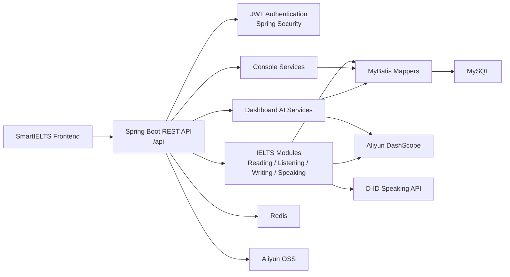

<p align="right">
  <a href="./README.md"></a>
  <a href="./README.zh-TW.md"></a>
</p>

<h1 align="center">SmartIELTS Backend</h1>

<p align="center">
  <strong>Complete backend source repository for SmartIELTS</strong><br>
  Spring Boot REST API for authentication, IELTS modules, records, dashboard AI, admin management, storage, and database persistence.
</p>

<p align="center">
  <strong>Java 17</strong> · <strong>Spring Boot 3.3.5</strong> · <strong>MyBatis</strong> · <strong>MySQL</strong> · <strong>Redis</strong>
</p>

---

## 1. Repository Purpose

**`SmartIELTS-backend` is the dedicated backend repository.**

This repository contains:

- Complete Spring Boot backend source code.
- Backend README and deployment guide.
- API contract and backend architecture documentation.
- Database migration and seed scripts.
- MyBatis mappers, services, controllers, and backend tests.

This repository should not contain the React frontend implementation. Frontend code belongs in `SmartIELTS-frontend`.

---

## 2. Repository Split

| Repository | Contains code | Main contents |
| --- | --- | --- |
| **SmartIELTS** | No | Main hub with overview README, architecture diagram, startup guide, deployment flow, repo links, demo screenshots, and API contract entry |
| **SmartIELTS-frontend** | Yes, frontend code | React/Vite/TypeScript source, frontend README, frontend deployment guide, `.env.example` |
| **SmartIELTS-backend** | Yes, backend code | Spring Boot source, backend README, API docs, DB migrations, backend deployment guide |

---

## 3. Backend Scope

- **Auth / Security**: register, login, JWT refresh, logout, password update, role-based access control.
- **User**: profile, profile picture, IELTS target score, learning progress.
- **Admin**: user management, exam content management, student record management.
- **IELTS modules**: Reading, Listening, Writing, Speaking content, sessions, submissions, scoring, record detail.
- **Record**: unified user/admin record list, detail, review, delete, restore.
- **Console**: deterministic user/admin overview data.
- **Dashboard AI**: natural-language ask, SQL generation, executive summary, learning context, answer rewrite.
- **Storage**: image/audio/file resources through `biz_image_resource` and Aliyun OSS.
- **AI integrations**: Aliyun DashScope, OCR, ASR, and D-ID speaking avatar flow.

---

## 4. Tech Stack

| Category | Technology |
| --- | --- |
| Language | Java 17 |
| Framework | Spring Boot 3.3.5 |
| Security | Spring Security, JWT |
| Database | MySQL 8+ |
| Mapper | MyBatis |
| Cache/runtime store | Redis |
| API docs | Knife4j / OpenAPI |
| Build | Maven Wrapper |
| Object storage | Aliyun OSS |
| AI/OCR/ASR | Aliyun DashScope, Aliyun OCR |
| Speaking avatar | D-ID API |
| Tests | JUnit 5, Mockito, Spring Boot Test |

---

## 5. Architecture



---

## 6. Project Structure

```text
SmartIELTS-backend/
  src/main/java/com/andrew/smartielts/
    admin/          Shared admin support
    auth/           Login, register, JWT, auth mapper/service
    common/         Result wrapper, constants, security, storage helpers
    console/        Deterministic admin/user overview data
    dashboard/      AI ask, SQL generation, answer rewrite, learning context
    listening/      Listening exam, audio, question, answer, record flow
    reading/        Reading exam, passage, question, answer, record flow
    record/         Unified user/admin record list, detail, review APIs
    speaking/       Speaking question, session, D-ID talk, AI scoring
    user/           User profile and admin user management
    writing/        Writing question, record, attachment, image, AI scoring

  src/main/resources/
    application.yml
    mapper/

  docs/
    api/api-contract.md
    backend/backend-overview.md
    database-overview.md
    database-production-cleanup-outline.md

  scripts/sql/
    DB migration and seed scripts
```

---

## 7. API Entry Points

| Area | Base Path | Role |
| --- | --- | --- |
| Auth | `/api/auth/**` | Public / authenticated refresh |
| User profile | `/api/user/**` | `USER` |
| Admin | `/api/admin/**` | `ADMIN` |
| User console | `/api/user/console/**` | `USER` |
| Admin console | `/api/admin/console/**` | `ADMIN` |
| Dashboard | `/api/smartielts/dashboard/**` | USER / ADMIN by endpoint |

Documentation:

- `docs/api/api-contract.md`
- `docs/backend/backend-overview.md`
- `docs/database-overview.md`

---

## 8. Authentication

The backend uses stateless JWT. It does not rely on server-side sessions or cookies.

Login:

```http
POST /api/auth/login
Content-Type: application/json
```

Request:

```json
{
  "email": "user@example.com",
  "password": "password123"
}
```

Subsequent requests:

```http
Authorization: Bearer <data.token>
```

JWT claims include `userId`, `role`, and `tokenVersion`. Logout and password changes increment `token_version`, which invalidates old tokens immediately.

---

## 9. Environment Requirements

| Dependency | Version / Notes |
| --- | --- |
| JDK | 17+ |
| MySQL | 8+ |
| Redis | 6+ |
| Maven | Use the included Maven Wrapper |
| Shell | PowerShell is recommended on Windows |

Optional external services:

- Aliyun OSS for images, audio, and attachments.
- Aliyun DashScope for Writing/Speaking scoring and Dashboard LLM.
- Aliyun OCR / ASR for image description and audio/transcript flow.
- D-ID for the Speaking avatar talk flow.

---

## 10. Local Startup

After configuring DB, Redis, and required environment variables:

```powershell
.\mvnw.cmd test
.\mvnw.cmd spring-boot:run
```

Default API:

```text
http://localhost:8080/api
```

Build JAR:

```powershell
.\mvnw.cmd clean package
```

Run JAR:

```powershell
java -jar target\SmartIELTS-0.0.1-SNAPSHOT.jar
```

---

## 11. DB Migration

SQL scripts:

```text
scripts/sql/
```

Common migrations:

| Script | Purpose |
| --- | --- |
| `speaking_talk.sql` | Required table for D-ID speaking talk flow |
| `user_profile_picture.sql` | User profile picture fields |
| `user_profile_targets.sql` | IELTS target score fields |
| `listening_test_allow_audio_seek.sql` | Listening audio seek settings |
| `reading_test_prep_seconds.sql` | Reading time setting migration |
| `listening_test_prep_seconds.sql` | Listening time setting migration |
| `writing_question_time_settings.sql` | Writing time setting migration |
| `biz_image_resource_target_index.sql` | Business image resource index |

Use `docs/database-overview.md` as the live schema reference.

---

## 12. Deployment Checklist

- MySQL schema and migrations are applied.
- Redis is reachable and production uses an isolated DB/index.
- `JWT_SECRET_KEY` is long, random, and not public.
- OSS bucket, domain, region, and access keys are configured.
- DashScope / OCR / ASR credentials and quotas are valid.
- D-ID webhook uses HTTPS.
- `.env`, secrets, tokens, and production dumps are not committed.
- API, DB, and backend flow changes are reflected in `docs/`.

---

## 13. Maintenance Rules

- API contract changes: update `docs/api/api-contract.md`.
- Package, service flow, or module boundary changes: update `docs/backend/backend-overview.md`.
- DB table, column, relationship, migration, or dashboard SQL allow-list changes: update `docs/database-overview.md`.
- Storage target/bucket/path values should come from `StorageBizConstants`.
- Dashboard queryable tables require `DashboardTableNameConstants` and `DashboardTableSchemaRegistry` checks.
- Never commit production secrets, passwords, tokens, access keys, or database dumps.

---

## 14. Related Links

| Resource | Link |
| --- | --- |
| Main hub | [SmartIELTS](https://github.com/Andrew-Ng701/SmartIELTS) |
| Frontend code | [SmartIELTS-frontend](https://github.com/Andrew-Ng701/SmartIELTS-frontend) |
| API contract | `docs/api/api-contract.md` |
| Backend overview | `docs/backend/backend-overview.md` |
| Database overview | `docs/database-overview.md` |
