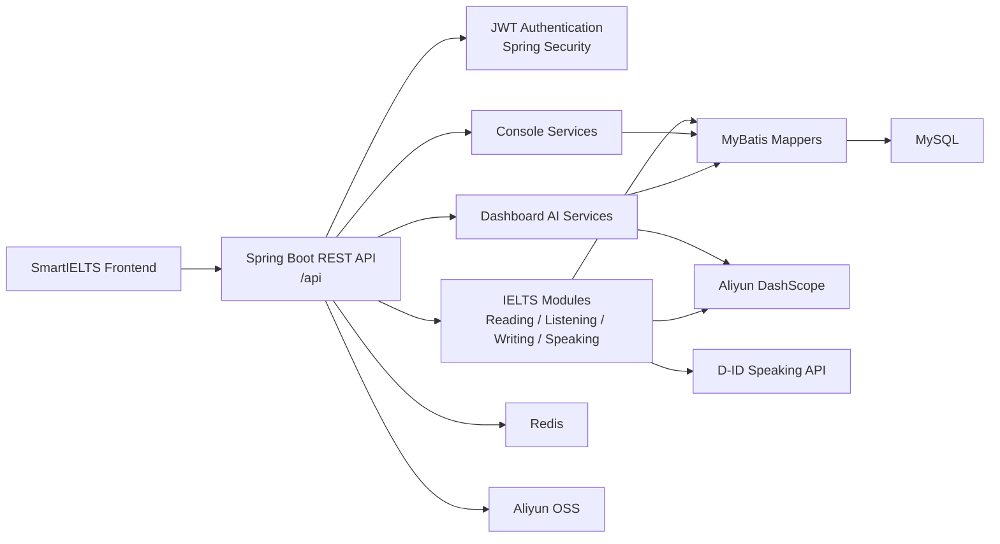

<p align="right">
  <a href="./README.md"></a>
  <a href="./README.zh-TW.md"></a>
</p>

# SmartIELTS Backend

**SmartIELTS Backend** is the backend service for the SmartIELTS platform. It powers **authentication, role-based access control, IELTS Reading / Listening / Writing / Speaking workflows, AI scoring, dashboard intelligence, admin management, file resources, and database persistence**.

> This repository is designed as **`SmartIELTS-backend`**. It contains the complete backend source code, backend README, API documentation, database migrations, deployment notes, and backend tests.

---

## Repository Layout

| Repository | Contains code | Responsibility |
| --- | --- | --- |
| **SmartIELTS** | No | Main project hub, product overview, architecture diagrams, frontend/backend links, screenshots, and end-to-end deployment explanation |
| **SmartIELTS-frontend** | Yes | Complete frontend source code, frontend README, frontend deployment guide, and frontend environment examples |
| **SmartIELTS-backend** | Yes | Complete backend source code, backend README, API documentation, DB migrations, and backend deployment guide |

This split keeps frontend and backend dependencies, history, and deployment pipelines clean. The main repository should act as the public-facing project hub, while this repository focuses only on backend engineering.

---

## Backend Overview

SmartIELTS Backend exposes REST APIs for an IELTS learning and practice platform.

Core responsibilities:

- **Auth / Security**: registration, login, JWT refresh, logout, password update, and role-based access control.
- **User**: profile data, profile picture, IELTS target score, and learning progress data.
- **Admin**: user management, exam content management, and student record management.
- **Reading / Listening / Writing / Speaking**: exam content, session flow, answer submission, scoring, record list, and record detail.
- **Record**: unified user/admin record list, detail, review, delete, and restore workflows.
- **Console**: deterministic overview data for dashboard-like frontend views.
- **Dashboard AI**: natural-language ask, SQL generation, executive summary, learning context, and answer rewrite.
- **Storage**: business image/audio/file resource management through `biz_image_resource` and Aliyun OSS.
- **AI Integrations**: Aliyun DashScope, OCR, ASR, and D-ID speaking avatar flow.

---

## Tech Stack

| Category | Technology |
| --- | --- |
| Language | **Java 17** |
| Framework | **Spring Boot 3.3.5** |
| Security | **Spring Security**, JWT |
| Database | **MySQL 8+** |
| Mapper | **MyBatis** |
| Cache / Runtime Store | **Redis** |
| API Documentation | **Knife4j / OpenAPI** |
| Build Tool | **Maven Wrapper** |
| Object Storage | **Aliyun OSS** |
| AI / OCR / ASR | **Aliyun DashScope**, Aliyun OCR |
| Speaking Avatar | **D-ID API** |
| Testing | JUnit 5, Mockito, Spring Boot Test |

---

## Architecture



---

## Project Structure

```text
SmartIELTS-backend/
  src/main/java/com/andrew/smartielts/
    admin/          Shared admin support
    auth/           Login, register, JWT, auth mapper/service
    common/         Result wrapper, constants, security, storage helpers
    console/        Deterministic admin/user overview data
    dashboard/      AI ask, SQL generation, answer rewrite, learning context
    listening/      Listening exam, audio, question, answer, record flow
    reading/        Reading exam, passage, question, answer, record flow
    record/         Unified user/admin record list, detail, review APIs
    speaking/       Speaking question, session, D-ID talk, AI scoring
    user/           User profile and admin user management
    writing/        Writing question, record, attachment, image, AI scoring

  src/main/resources/
    application.yml
    mapper/         MyBatis XML mapper files

  src/test/java/
    Unit and service tests

  docs/
    api/api-contract.md
    backend/backend-overview.md
    database-overview.md
    database-production-cleanup-outline.md

  scripts/
    sql/            Migration and seed scripts
    smoke/          Manual smoke test scripts
```

---

## Main API Areas

| Area | Base Path | Role |
| --- | --- | --- |
| Auth | `/api/auth/**` | Public / authenticated refresh |
| User profile | `/api/user/**` | `USER` |
| Admin | `/api/admin/**` | `ADMIN` |
| User console | `/api/user/console/**` | `USER` |
| Admin console | `/api/admin/console/**` | `ADMIN` |
| User dashboard | `/api/user/dashboard/**` | `USER` |
| Admin dashboard | `/api/admin/dashboard/**` | `ADMIN` |

Documentation entry points:

- **API contract**: `docs/api/api-contract.md`
- **Backend overview**: `docs/backend/backend-overview.md`
- **Database overview**: `docs/database-overview.md`

---

## Authentication

SmartIELTS Backend uses **stateless JWT authentication**. It does not rely on server-side sessions or cookies.

Login endpoint:

```http
POST /api/auth/login
Content-Type: application/json
```

Request:

```json
{
  "email": "user@example.com",
  "password": "password123"
}
```

After login, use `data.token` in the `Authorization` header:

```http
Authorization: Bearer <data.token>
```

JWT claims include:

- `userId`
- `role`
- `tokenVersion`

Calling logout or changing the password increments `token_version`, which immediately invalidates old tokens.

---

## Environment Requirements

| Dependency | Version / Notes |
| --- | --- |
| JDK | **17+** |
| MySQL | **8+** |
| Redis | **6+** |
| Maven | Use the included Maven Wrapper |
| Shell | PowerShell is recommended on Windows |

Optional external services:

- **Aliyun OSS** for images, audio, and file attachments.
- **Aliyun DashScope** for writing/speaking scoring and dashboard LLM features.
- **Aliyun OCR / ASR** for image description and listening/speaking workflows.
- **D-ID** for the speaking avatar talk flow.

---

## Environment Variables

Configuration source: `src/main/resources/application.yml`

**Never commit real secrets, passwords, tokens, or access keys.**

### Required for Basic Startup

```powershell
$env:SERVER_PORT="8080"
$env:SPRING_APPLICATION_NAME="SmartIELTS"
$env:SPRING_MVC_SERVLET_PATH="/api"

$env:DB_URL="jdbc:mysql://127.0.0.1:3306/smartielts?useUnicode=true&characterEncoding=utf8&serverTimezone=Asia/Hong_Kong"
$env:DB_USERNAME="root"
$env:DB_PASSWORD="your_password"

$env:REDIS_HOST="127.0.0.1"
$env:REDIS_PORT="6379"
$env:REDIS_DATABASE="0"

$env:JWT_SECRET_KEY="replace-with-a-long-random-secret"
$env:JWT_TTL="7200000"
$env:JWT_REFRESH_INTERVAL="900000"
```

### Required for File Upload / Media Features

```powershell
$env:ALIYUN_OSS_ENDPOINT=""
$env:ALIYUN_OSS_REGION=""
$env:ALIYUN_OSS_ACCESS_KEY_ID=""
$env:ALIYUN_OSS_ACCESS_KEY_SECRET=""

$env:ALIYUN_OSS_BUCKET_WRITING_QUESTION=""
$env:ALIYUN_OSS_DOMAIN_WRITING_QUESTION=""
$env:ALIYUN_OSS_BUCKET_WRITING_RECORD=""
$env:ALIYUN_OSS_DOMAIN_WRITING_RECORD=""
$env:ALIYUN_OSS_BUCKET_LISTENING_AUDIO=""
$env:ALIYUN_OSS_DOMAIN_LISTENING_AUDIO=""
$env:ALIYUN_OSS_BUCKET_SPEAKING_AUDIO=""
$env:ALIYUN_OSS_DOMAIN_SPEAKING_AUDIO=""
$env:ALIYUN_OSS_BUCKET_QUESTION_GROUP_IMAGE=""
$env:ALIYUN_OSS_DOMAIN_QUESTION_GROUP_IMAGE=""
$env:ALIYUN_OSS_BUCKET_USER_PROFILE_PICTURE=""
$env:ALIYUN_OSS_DOMAIN_USER_PROFILE_PICTURE=""
```

### Required for AI Features

```powershell
$env:ALIYUN_AI_BASE_URL="https://dashscope.aliyuncs.com/compatible-mode/v1"
$env:ALIYUN_AI_API_KEY=""
$env:WRITING_SCORE_AI_MODEL="qwen3.6-plus"
$env:SPEAKING_SCORE_AI_MODEL="qwen3-omni-flash"

$env:ALIYUN_OCR_ACCESS_KEY_ID=""
$env:ALIYUN_OCR_ACCESS_KEY_SECRET=""
$env:ALIYUN_OCR_ENDPOINT="ocr-api.cn-hangzhou.aliyuncs.com"
```

### Required for D-ID Speaking Flow

```powershell
$env:DID_BASE_URL="https://api.d-id.com"
$env:DID_API_KEY=""
$env:DID_WEBHOOK_URL="https://your-domain.com/api/speaking/webhook/end"
$env:DID_PRESENTER_ID=""
$env:DID_VOICE_ID="en-US-JennyNeural"
```

---

## Database Setup

1. Create a MySQL database, for example `smartielts`.
2. Apply the required schema and migration scripts.
3. Apply seed scripts if demo data is needed.
4. Start Redis.
5. Configure `DB_URL`, `DB_USERNAME`, and `DB_PASSWORD`.

SQL scripts location:

```text
scripts/sql/
```

Common migration / setup scripts:

| Script | Purpose |
| --- | --- |
| `speaking_talk.sql` | Required table for the D-ID speaking talk flow |
| `user_profile_picture.sql` | User profile picture fields |
| `user_profile_targets.sql` | IELTS target score fields |
| `listening_test_allow_audio_seek.sql` | Listening audio seek settings |
| `reading_test_prep_seconds.sql` | Reading time setting migration |
| `listening_test_prep_seconds.sql` | Listening time setting migration |
| `writing_question_time_settings.sql` | Writing time setting migration |
| `biz_image_resource_target_index.sql` | Business image resource index |

Use `docs/database-overview.md` as the live database structure reference.

---

## Local Development

### 1. Check Maven Wrapper

```powershell
.\mvnw.cmd -v
```

### 2. Run Tests

```powershell
.\mvnw.cmd test
```

### 3. Start Backend

```powershell
.\mvnw.cmd spring-boot:run
```

Default service URL:

```text
http://localhost:8080/api
```

### 4. Build JAR

```powershell
.\mvnw.cmd clean package
```

Build output:

```text
target/SmartIELTS-0.0.1-SNAPSHOT.jar
```

---

## Production Deployment

### Build

```powershell
.\mvnw.cmd clean package
```

### Run

```powershell
java -jar target\SmartIELTS-0.0.1-SNAPSHOT.jar
```

### Production Checklist

- **Database**: latest MySQL schema and migrations are applied.
- **Redis**: connection is available and production uses an isolated database/index.
- **JWT**: `JWT_SECRET_KEY` is long, random, and not shared publicly.
- **OSS**: bucket names, domains, region, and access keys are configured.
- **AI**: DashScope / OCR / ASR credentials and quota are valid.
- **D-ID**: production webhook uses HTTPS.
- **Security**: `.env`, secrets, tokens, and production dumps are not committed.
- **Docs**: API and DB changes are reflected in `docs/`.

---

## Testing Strategy

The test suite focuses on service and unit coverage for:

- Auth login validation
- Question answer rule judging
- Console overview services
- Dashboard ask / SQL / learning context
- Exam time settings
- Reading / Listening admin and user flows
- Record list/detail/review
- Speaking scoring and final evaluation fallback
- Writing scoring and image description
- User profile and admin user management

Run:

```powershell
.\mvnw.cmd test
```

Expected successful result:

```text
Tests run: 119, Failures: 0, Errors: 0, Skipped: 0
BUILD SUCCESS
```

---

## Development Rules

Read `AGENTS.md` before making project changes.

Important maintenance rules:

- **API contract changes**: update `docs/api/api-contract.md`.
- **Backend flow / package boundary changes**: update `docs/backend/backend-overview.md`.
- **DB schema / migration / dashboard SQL allow-list changes**: update `docs/database-overview.md`.
- **Storage target / bucket / path**: use `StorageBizConstants` as the source of truth.
- **Dashboard queryable tables**: check `DashboardTableNameConstants` and `DashboardTableSchemaRegistry`.
- **Frontend/backend ownership**: business rules, authorization, scoring, persistence, and server-owned values belong on the backend.
- **Secrets**: never commit real tokens, passwords, access keys, or production secrets.

---

## Useful Links Inside This Repository

| Document | Description |
| --- | --- |
| `AGENTS.md` | Project rules and existing conclusions |
| `docs/api/api-contract.md` | Frontend/backend API contract |
| `docs/backend/backend-overview.md` | Backend modules, service flow, package boundaries |
| `docs/database-overview.md` | Live database schema overview |
| `docs/database-production-cleanup-outline.md` | Production cleanup and temporary structure notes |
| `scripts/sql/` | DB migration and seed scripts |
| `scripts/smoke/` | Manual smoke test scripts |

---

## Repository Links

Planned repository structure:

- **Main project hub**: `SmartIELTS`
- **Frontend repository**: `SmartIELTS-frontend`
- **Backend repository**: `SmartIELTS-backend`

After the GitHub repositories are fully split, update this section with the actual URLs.

---

## Current Release Note

This backend release includes:

- Dashboard, Console, Record, Exam wrapper, and IELTS module backend updates.
- Reading / Listening / Writing time settings and related migrations.
- Business image resource and OSS target cleanup.
- User profile picture, IELTS target score, and consecutive login days.
- Admin/user record list, detail, review, delete, and restore flows.
- Writing image description service and AI scoring tests.
- Dashboard AI ask, learning context, SQL generation, answer compose/rewrite tests.
- API, backend overview, and database overview documentation updates.

---

## License / Usage

This repository is currently used as the backend codebase for the SmartIELTS system. For public presentation, the main `SmartIELTS` repository should include the formal license, screenshots, architecture overview, demo notes, and frontend/backend repository links.
