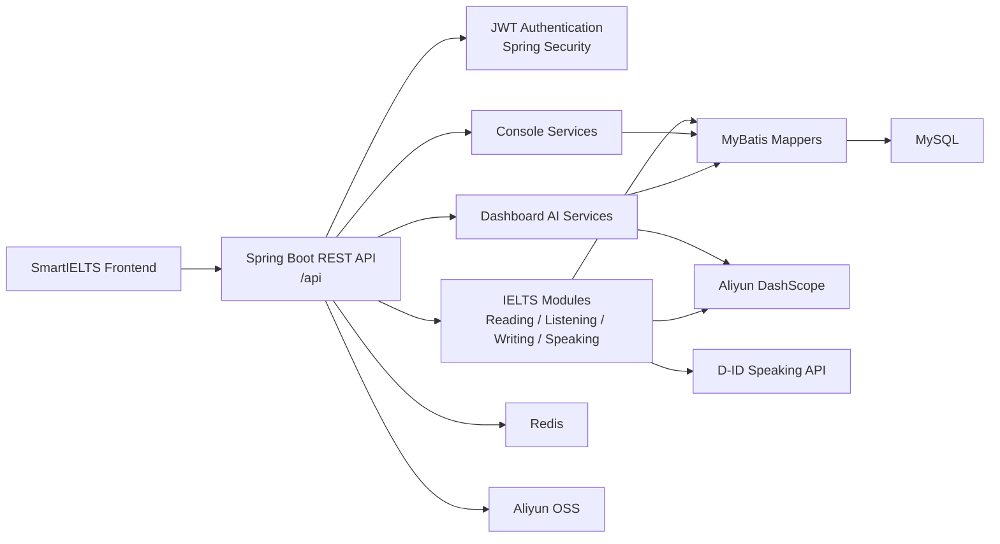

<p align="right">
  <a href="./README.md"></a>
  <a href="./README.zh-TW.md"></a>
</p>

# SmartIELTS Backend

**SmartIELTS Backend** 是 SmartIELTS 系統的後端服務，負責 **身份驗證、權限控制、IELTS 四科考試流程、AI 評分、Dashboard 智能查詢、後台管理、檔案資源管理與資料持久化**。

> 本倉庫定位為 **`SmartIELTS-backend`**：只保存後端完整代碼、後端 README、API 文件、DB migration、部署說明與後端測試。

---

## Repository 分工

| Repository | 是否放代碼 | 負責內容 |
| --- | --- | --- |
| **SmartIELTS** | 否 | 主專案總覽、系統介紹、架構圖、前後端 repo links、demo screenshots、整體部署流程 |
| **SmartIELTS-frontend** | 是 | 前端完整代碼、前端 README、前端部署說明、前端環境變數範例 |
| **SmartIELTS-backend** | 是 | 後端完整代碼、後端 README、API 文件、DB migration、後端部署說明 |

這樣拆分後，前後端可以各自管理依賴、CI/CD、commit history 與部署流程；主倉庫則作為對外展示與整體說明入口。

---

## Backend Overview

SmartIELTS Backend 提供一套面向 IELTS 練習平台的 REST API。

核心責任包括：

- **Auth / Security**：註冊、登入、JWT refresh、登出、密碼修改、role-based access control。
- **User**：個人資料、profile picture、IELTS target score、學習進度資料。
- **Admin**：使用者管理、考試內容管理、學生作答記錄管理。
- **Reading / Listening / Writing / Speaking**：四科考試內容、作答流程、批改、記錄與詳情。
- **Record**：統一 user/admin record list、detail、review、delete、restore。
- **Console**：固定 overview data，支援前端 dashboard/console 畫面快速渲染。
- **Dashboard AI**：自然語言 ask、SQL generation、executive summary、learning context、answer rewrite。
- **Storage**：透過 `biz_image_resource` 與 Aliyun OSS 管理圖片、音訊與業務資源。
- **AI Integration**：Aliyun DashScope / OCR / ASR 與 D-ID speaking avatar flow。

---

## Tech Stack

| Category | Technology |
| --- | --- |
| Language | **Java 17** |
| Framework | **Spring Boot 3.3.5** |
| Security | **Spring Security**, JWT |
| Database | **MySQL 8+** |
| Mapper | **MyBatis** |
| Cache / Runtime Store | **Redis** |
| API Documentation | **Knife4j / OpenAPI** |
| Build Tool | **Maven Wrapper** |
| Object Storage | **Aliyun OSS** |
| AI / OCR / ASR | **Aliyun DashScope**, Aliyun OCR |
| Speaking Avatar | **D-ID API** |
| Testing | JUnit 5, Mockito, Spring Boot Test |

---

## Architecture



---

## Project Structure

```text
SmartIELTS-backend/
  src/main/java/com/andrew/smartielts/
    admin/          Shared admin support
    auth/           Login, register, JWT, auth mapper/service
    common/         Result wrapper, constants, security, storage helpers
    console/        Deterministic admin/user overview data
    dashboard/      AI ask, SQL generation, answer rewrite, learning context
    listening/      Listening exam, audio, question, answer, record flow
    reading/        Reading exam, passage, question, answer, record flow
    record/         Unified user/admin record list, detail, review APIs
    speaking/       Speaking question, session, D-ID talk, AI scoring
    user/           User profile and admin user management
    writing/        Writing question, record, attachment, image, AI scoring

  src/main/resources/
    application.yml
    mapper/         MyBatis XML mapper files

  src/test/java/
    Unit and service tests

  docs/
    api/api-contract.md
    backend/backend-overview.md
    database-overview.md
    database-production-cleanup-outline.md

  scripts/
    sql/            Migration and seed scripts
    smoke/          Manual smoke test scripts
```

---

## Main API Areas

| Area | Base Path | Role |
| --- | --- | --- |
| Auth | `/api/auth/**` | Public / authenticated refresh |
| User profile | `/api/user/**` | `USER` |
| Admin | `/api/admin/**` | `ADMIN` |
| User console | `/api/user/console/**` | `USER` |
| Admin console | `/api/admin/console/**` | `ADMIN` |
| User dashboard | `/api/user/dashboard/**` | `USER` |
| Admin dashboard | `/api/admin/dashboard/**` | `ADMIN` |

文件入口：

- **API contract**：`docs/api/api-contract.md`
- **Backend overview**：`docs/backend/backend-overview.md`
- **Database overview**：`docs/database-overview.md`

---

## Authentication

本專案使用 **stateless JWT authentication**，不依賴 server-side session 或 cookie。

登入 endpoint：

```http
POST /api/auth/login
Content-Type: application/json
```

Request：

```json
{
  "email": "user@example.com",
  "password": "password123"
}
```

登入後請把 `data.token` 放入 `Authorization` header：

```http
Authorization: Bearer <data.token>
```

JWT claims 包含：

- `userId`
- `role`
- `tokenVersion`

執行 logout 或修改密碼後，系統會遞增 `token_version`，舊 token 會立即失效。

---

## Environment Requirements

| Dependency | Version / Notes |
| --- | --- |
| JDK | **17+** |
| MySQL | **8+** |
| Redis | **6+** |
| Maven | 使用內建 Maven Wrapper |
| Shell | Windows 建議使用 PowerShell |

依功能啟用的外部服務：

- **Aliyun OSS**：圖片、音訊、附件資源儲存。
- **Aliyun DashScope**：writing/speaking scoring 與 dashboard LLM。
- **Aliyun OCR / ASR**：圖片描述與 listening/speaking workflow。
- **D-ID**：speaking avatar talk flow。

---

## Environment Variables

設定來源：`src/main/resources/application.yml`

**不要提交真實 secret、password、token 或 access key。**

### Basic Startup

```powershell
$env:SERVER_PORT="8080"
$env:SPRING_APPLICATION_NAME="SmartIELTS"
$env:SPRING_MVC_SERVLET_PATH="/api"

$env:DB_URL="jdbc:mysql://127.0.0.1:3306/smartielts?useUnicode=true&characterEncoding=utf8&serverTimezone=Asia/Hong_Kong"
$env:DB_USERNAME="root"
$env:DB_PASSWORD="your_password"

$env:REDIS_HOST="127.0.0.1"
$env:REDIS_PORT="6379"
$env:REDIS_DATABASE="0"

$env:JWT_SECRET_KEY="replace-with-a-long-random-secret"
$env:JWT_TTL="7200000"
$env:JWT_REFRESH_INTERVAL="900000"
```

### File Upload / Media Features

```powershell
$env:ALIYUN_OSS_ENDPOINT=""
$env:ALIYUN_OSS_REGION=""
$env:ALIYUN_OSS_ACCESS_KEY_ID=""
$env:ALIYUN_OSS_ACCESS_KEY_SECRET=""

$env:ALIYUN_OSS_BUCKET_WRITING_QUESTION=""
$env:ALIYUN_OSS_DOMAIN_WRITING_QUESTION=""
$env:ALIYUN_OSS_BUCKET_WRITING_RECORD=""
$env:ALIYUN_OSS_DOMAIN_WRITING_RECORD=""
$env:ALIYUN_OSS_BUCKET_LISTENING_AUDIO=""
$env:ALIYUN_OSS_DOMAIN_LISTENING_AUDIO=""
$env:ALIYUN_OSS_BUCKET_SPEAKING_AUDIO=""
$env:ALIYUN_OSS_DOMAIN_SPEAKING_AUDIO=""
$env:ALIYUN_OSS_BUCKET_QUESTION_GROUP_IMAGE=""
$env:ALIYUN_OSS_DOMAIN_QUESTION_GROUP_IMAGE=""
$env:ALIYUN_OSS_BUCKET_USER_PROFILE_PICTURE=""
$env:ALIYUN_OSS_DOMAIN_USER_PROFILE_PICTURE=""
```

### AI Features

```powershell
$env:ALIYUN_AI_BASE_URL="https://dashscope.aliyuncs.com/compatible-mode/v1"
$env:ALIYUN_AI_API_KEY=""
$env:WRITING_SCORE_AI_MODEL="qwen3.6-plus"
$env:SPEAKING_SCORE_AI_MODEL="qwen3-omni-flash"

$env:ALIYUN_OCR_ACCESS_KEY_ID=""
$env:ALIYUN_OCR_ACCESS_KEY_SECRET=""
$env:ALIYUN_OCR_ENDPOINT="ocr-api.cn-hangzhou.aliyuncs.com"
```

### D-ID Speaking Flow

```powershell
$env:DID_BASE_URL="https://api.d-id.com"
$env:DID_API_KEY=""
$env:DID_WEBHOOK_URL="https://your-domain.com/api/speaking/webhook/end"
$env:DID_PRESENTER_ID=""
$env:DID_VOICE_ID="en-US-JennyNeural"
```

---

## Database Setup

1. 建立 MySQL database，例如 `smartielts`。
2. 套用必要 schema 與 migration scripts。
3. 如果需要 demo data，再套用 seed scripts。
4. 啟動 Redis。
5. 設定 `DB_URL`、`DB_USERNAME`、`DB_PASSWORD`。

SQL scripts 位置：

```text
scripts/sql/
```

常見 migration / setup scripts：

| Script | Purpose |
| --- | --- |
| `speaking_talk.sql` | D-ID speaking talk flow 必需表 |
| `user_profile_picture.sql` | User profile picture 欄位 |
| `user_profile_targets.sql` | IELTS target score 欄位 |
| `listening_test_allow_audio_seek.sql` | Listening audio seek 設定 |
| `reading_test_prep_seconds.sql` | Reading time setting migration |
| `listening_test_prep_seconds.sql` | Listening time setting migration |
| `writing_question_time_settings.sql` | Writing time setting migration |
| `biz_image_resource_target_index.sql` | Business image resource index |

Live database structure 以 `docs/database-overview.md` 為準。

---

## Local Development

### 1. 檢查 Maven Wrapper

```powershell
.\mvnw.cmd -v
```

### 2. 執行測試

```powershell
.\mvnw.cmd test
```

### 3. 啟動後端

```powershell
.\mvnw.cmd spring-boot:run
```

預設服務位址：

```text
http://localhost:8080/api
```

### 4. 建置 JAR

```powershell
.\mvnw.cmd clean package
```

輸出位置：

```text
target/SmartIELTS-0.0.1-SNAPSHOT.jar
```

---

## Production Deployment

### Build

```powershell
.\mvnw.cmd clean package
```

### Run

```powershell
java -jar target\SmartIELTS-0.0.1-SNAPSHOT.jar
```

### Production Checklist

- **Database**：MySQL schema 與 migrations 已更新。
- **Redis**：連線可用，production 使用獨立 database/index。
- **JWT**：`JWT_SECRET_KEY` 足夠長、隨機且不可公開。
- **OSS**：bucket、domain、region、access key 設定正確。
- **AI**：DashScope / OCR / ASR credentials 與 quota 可用。
- **D-ID**：production webhook 使用 HTTPS。
- **Security**：不要提交 `.env`、secret、token 或 production dump。
- **Docs**：API 與 DB 變更同步反映到 `docs/`。

---

## Testing Strategy

測試主要覆蓋：

- Auth login validation
- Question answer rule judging
- Console overview services
- Dashboard ask / SQL / learning context
- Exam time settings
- Reading / Listening admin and user flows
- Record list/detail/review
- Speaking scoring and final evaluation fallback
- Writing scoring and image description
- User profile and admin user management

執行：

```powershell
.\mvnw.cmd test
```

成功範例：

```text
Tests run: 119, Failures: 0, Errors: 0, Skipped: 0
BUILD SUCCESS
```

---

## Development Rules

修改前請先閱讀 `AGENTS.md`。

重要維護規則：

- **API contract 變更**：更新 `docs/api/api-contract.md`。
- **Backend flow / package boundary 變更**：更新 `docs/backend/backend-overview.md`。
- **DB schema / migration / dashboard SQL allow-list 變更**：更新 `docs/database-overview.md`。
- **Storage target / bucket / path**：以 `StorageBizConstants` 作為來源。
- **Dashboard 可查詢表**：檢查 `DashboardTableNameConstants` 與 `DashboardTableSchemaRegistry`。
- **前後端職責**：業務規則、權限、評分、持久化與 server-owned values 放後端。
- **Secrets**：禁止提交真實 token、password、access key 或 production secret。

---

## Useful Links Inside This Repository

| Document | Description |
| --- | --- |
| `AGENTS.md` | 專案開發規則與既有結論 |
| `docs/api/api-contract.md` | 前後端 API contract |
| `docs/backend/backend-overview.md` | 後端模組、service flow、package boundary |
| `docs/database-overview.md` | live database schema overview |
| `docs/database-production-cleanup-outline.md` | production cleanup / temporary structure notes |
| `scripts/sql/` | DB migration and seed scripts |
| `scripts/smoke/` | manual smoke test scripts |

---

## Repository Links

目前規劃：

- **Main project hub**：`SmartIELTS`
- **Frontend repository**：`SmartIELTS-frontend`
- **Backend repository**：`SmartIELTS-backend`

完成 GitHub repository 拆分後，請在此章節補上實際 URL。

---

## Current Release Note

本次後端整理包含：

- Dashboard、Console、Record、Exam wrapper 與 IELTS module 後端更新。
- Reading / Listening / Writing time settings 與相關 migration。
- Business image resource 與 OSS target 整理。
- User profile picture、IELTS target score、consecutive login days。
- Admin/user record list、detail、review、delete、restore flows。
- Writing image description service 與 AI scoring tests。
- Dashboard AI ask、learning context、SQL generation、answer compose/rewrite tests。
- API、backend overview、database overview 文件更新。

---

## License / Usage

此 repository 目前作為 SmartIELTS 系統後端代碼倉庫使用。若要公開展示，建議在主倉庫 `SmartIELTS` 補上正式 license、demo screenshots、系統架構圖、demo notes 與前後端 repository links。
