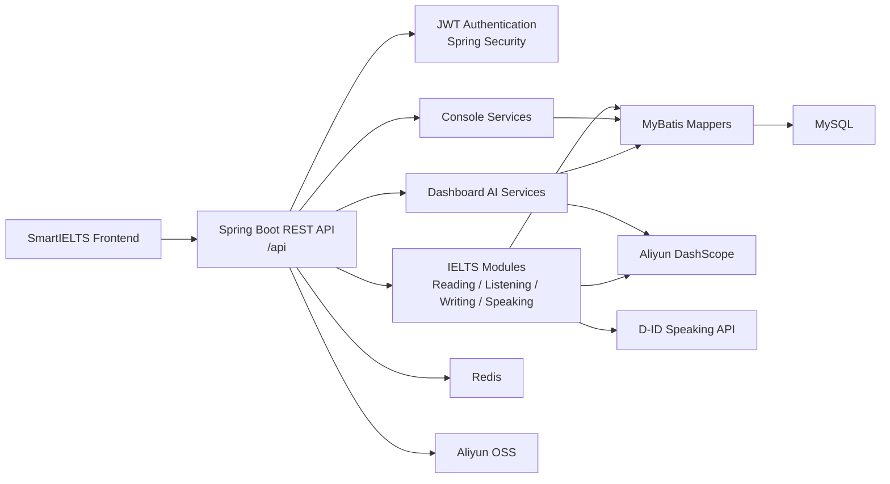

<p align="right">
  <a href="./README.md"></a>
  <a href="./README.zh-TW.md"></a>
</p>

<h1 align="center">SmartIELTS Backend</h1>

<p align="center">
  <strong>SmartIELTS 後端完整代碼倉庫</strong><br>
  Spring Boot REST API，負責 authentication、IELTS modules、records、dashboard AI、admin、storage 與 database persistence。
</p>

<p align="center">
  <strong>Java 17</strong> · <strong>Spring Boot 3.3.5</strong> · <strong>MyBatis</strong> · <strong>MySQL</strong> · <strong>Redis</strong>
</p>

---

## 1. 倉庫定位

**`SmartIELTS-backend` 是專門放後端代碼的倉庫。**

本倉庫包含：

- Spring Boot 後端完整 source code。
- 後端 README 與部署說明。
- API contract 與 backend overview。
- DB migration / seed scripts。
- MyBatis mapper、service、controller、unit/service tests。

本倉庫不放 React frontend implementation；前端代碼應放在 `SmartIELTS-frontend`。

---

## 2. 三倉庫結構

| Repository | 是否放代碼 | 主要內容 |
| --- | --- | --- |
| **SmartIELTS** | 否 | 主倉庫，只放總覽 README、架構圖、啟動方式、部署流程、repo links、demo screenshots、API contract 入口 |
| **SmartIELTS-frontend** | 是，前端代碼 | React/Vite/TypeScript source、前端 README、前端部署說明、`.env.example` |
| **SmartIELTS-backend** | 是，後端代碼 | Spring Boot source、後端 README、API docs、DB migrations、後端部署說明 |

---

## 3. 後端功能範圍

- **Auth / Security**：register、login、JWT refresh、logout、password update、role-based access control。
- **User**：profile、profile picture、IELTS target score、learning progress。
- **Admin**：user management、exam content management、student record management。
- **IELTS modules**：Reading、Listening、Writing、Speaking content、session、submission、scoring、record detail。
- **Record**：unified user/admin record list、detail、review、delete、restore。
- **Console**：deterministic user/admin overview data。
- **Dashboard AI**：natural-language ask、SQL generation、executive summary、learning context、answer rewrite。
- **Storage**：透過 `biz_image_resource` 與 Aliyun OSS 管理 image/audio/file resource。
- **AI integrations**：Aliyun DashScope、OCR、ASR、D-ID speaking avatar flow。

---

## 4. 技術棧

| 類別 | 技術 |
| --- | --- |
| Language | Java 17 |
| Framework | Spring Boot 3.3.5 |
| Security | Spring Security、JWT |
| Database | MySQL 8+ |
| Mapper | MyBatis |
| Cache/runtime store | Redis |
| API docs | Knife4j / OpenAPI |
| Build | Maven Wrapper |
| Object storage | Aliyun OSS |
| AI/OCR/ASR | Aliyun DashScope、Aliyun OCR |
| Speaking avatar | D-ID API |
| Tests | JUnit 5、Mockito、Spring Boot Test |

---

## 5. 架構



---

## 6. 專案結構

```text
SmartIELTS-backend/
  src/main/java/com/andrew/smartielts/
    admin/          Shared admin support
    auth/           Login, register, JWT, auth mapper/service
    common/         Result wrapper, constants, security, storage helpers
    console/        Deterministic admin/user overview data
    dashboard/      AI ask, SQL generation, answer rewrite, learning context
    listening/      Listening exam, audio, question, answer, record flow
    reading/        Reading exam, passage, question, answer, record flow
    record/         Unified user/admin record list, detail, review APIs
    speaking/       Speaking question, session, D-ID talk, AI scoring
    user/           User profile and admin user management
    writing/        Writing question, record, attachment, image, AI scoring

  src/main/resources/
    application.yml
    mapper/

  docs/
    api/api-contract.md
    backend/backend-overview.md
    database-overview.md
    database-production-cleanup-outline.md

  scripts/sql/
    DB migration and seed scripts
```

---

## 7. API 入口

| Area | Base Path | Role |
| --- | --- | --- |
| Auth | `/api/auth/**` | Public / authenticated refresh |
| User profile | `/api/user/**` | `USER` |
| Admin | `/api/admin/**` | `ADMIN` |
| User console | `/api/user/console/**` | `USER` |
| Admin console | `/api/admin/console/**` | `ADMIN` |
| Dashboard | `/api/smartielts/dashboard/**` | USER / ADMIN by endpoint |

文件入口：

- `docs/api/api-contract.md`
- `docs/backend/backend-overview.md`
- `docs/database-overview.md`

---

## 8. 登入與權限

後端使用 stateless JWT，不使用 session 或 cookie 判斷登入狀態。

登入：

```http
POST /api/auth/login
Content-Type: application/json
```

Request：

```json
{
  "email": "user@example.com",
  "password": "password123"
}
```

後續 request：

```http
Authorization: Bearer <data.token>
```

JWT claims 包含 `userId`、`role`、`tokenVersion`。`logout` 或 `password change` 會遞增 `token_version`，舊 token 立即失效。

---

## 9. 環境需求

| Dependency | Version / Notes |
| --- | --- |
| JDK | 17+ |
| MySQL | 8+ |
| Redis | 6+ |
| Maven | 使用內建 Maven Wrapper |
| Shell | Windows 建議 PowerShell |

選用外部服務：

- Aliyun OSS：images、audio、attachments。
- Aliyun DashScope：Writing/Speaking scoring、Dashboard LLM。
- Aliyun OCR / ASR：image description、audio/transcript flow。
- D-ID：Speaking avatar talk flow。

---

## 10. 本地啟動

設定 DB、Redis 與必要環境變數後：

```powershell
.\mvnw.cmd test
.\mvnw.cmd spring-boot:run
```

預設 API：

```text
http://localhost:8080/api
```

Build JAR：

```powershell
.\mvnw.cmd clean package
```

Run JAR：

```powershell
java -jar target\SmartIELTS-0.0.1-SNAPSHOT.jar
```

---

## 11. DB Migration

SQL scripts：

```text
scripts/sql/
```

常見 migration：

| Script | 用途 |
| --- | --- |
| `speaking_talk.sql` | D-ID speaking talk flow 必需表 |
| `user_profile_picture.sql` | User profile picture 欄位 |
| `user_profile_targets.sql` | IELTS target score 欄位 |
| `listening_test_allow_audio_seek.sql` | Listening audio seek settings |
| `reading_test_prep_seconds.sql` | Reading time setting migration |
| `listening_test_prep_seconds.sql` | Listening time setting migration |
| `writing_question_time_settings.sql` | Writing time setting migration |
| `biz_image_resource_target_index.sql` | Business image resource index |

Live schema 以 `docs/database-overview.md` 為準。

---

## 12. 部署檢查

- MySQL schema 與 migrations 已套用。
- Redis 可連線且 production 使用獨立 DB/index。
- `JWT_SECRET_KEY` 足夠長、隨機、未公開。
- OSS bucket、domain、region、access key 已配置。
- DashScope / OCR / ASR credentials 與 quota 正常。
- D-ID webhook 使用 HTTPS。
- `.env`、secrets、token、production dump 沒有 commit。
- API / DB / backend flow 變動已同步更新 `docs/`。

---

## 13. 維護規則

- 修改 API contract 時同步更新 `docs/api/api-contract.md`。
- 修改 package、service flow、module boundary 時同步更新 `docs/backend/backend-overview.md`。
- 修改 DB table、column、relationship、migration、dashboard SQL allow-list 時同步更新 `docs/database-overview.md`。
- Storage target/bucket/path 以 `StorageBizConstants` 為來源。
- Dashboard queryable tables 需同步檢查 `DashboardTableNameConstants` 與 `DashboardTableSchemaRegistry`。
- 不提交 production secrets、password、token、access key 或 database dump。

---

## 14. 相關連結

| Resource | Link |
| --- | --- |
| Main hub | [SmartIELTS](https://github.com/Andrew-Ng701/SmartIELTS) |
| Frontend code | [SmartIELTS-frontend](https://github.com/Andrew-Ng701/SmartIELTS-frontend) |
| API contract | `docs/api/api-contract.md` |
| Backend overview | `docs/backend/backend-overview.md` |
| Database overview | `docs/database-overview.md` |
